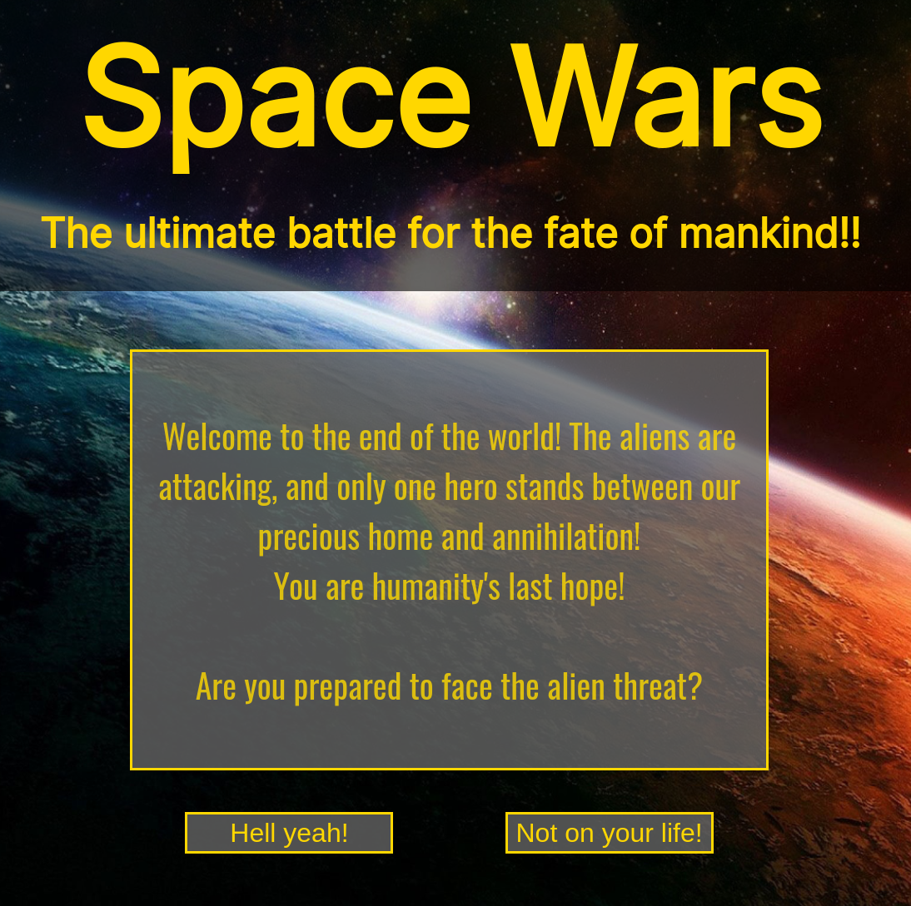

[](https://generalassemb.ly)

# Space Battle JS Console Game



Use your knowledge of JS objects, loops, and functions to build a **space battle** game. The game will be programmed for, and played in the Chrome console. You will need to use the built-in `prompt` to get user input, and you may use `console.logs` or `alerts` to relay information to the user.

Planning a program is a challenge unto itself. START SIMPLE. Break the problem down as far as you can and don't move on until the smallest piece works.

Once you've figured out the basics, it's up to you to make the game you want, but remember,
Your game does not have to be elegant. The only thing that matters is that it works.

## Set Up

1. Fork and clone this repository.
1. Change into the newly created directory `cd space-battle`.
1. Create a new `dev` branch: `git checkout -b dev`.
1. Add an `index.html` and `app.js` with `touch index.html app.js`.
1. Add your HTML boilerplate and connect the app.js file to it.
1. Build your app, making frequent commits. When done open a PR with your submission.

This assignment is a deliverable. Deliverables are due by the date indicated on your cohort calendar. 

## Game Requirements

Earth has been attacked by a horde of aliens! You are the captain of the USS Schwarzenegger, on a mission to destroy every last alien ship.

Battle the aliens as you try to destroy them with your lasers.

There are six alien ships. The aliens' weakness is that they are too logical and attack one at a time: they will wait to see the outcome of a battle before deploying another alien ship. Your strength is that you have the initiative and get to attack first. However, you do not have targeting lasers and can only attack the aliens in order. After you have destroyed a ship, you have the option to make a hasty retreat.

A game round would look like this:

- You attack the first alien ship
- If the ship survives, it attacks you
- If you survive, you attack the ship again
- If it survives, it attacks you again
- Etc.

- If you destroy the ship, you have the option to **attack** the next ship or to **retreat**

- If you retreat, the game is over, perhaps leaving the game open for further developments or options.

- You win the game if you destroy all of the aliens.

- You lose the game if you are destroyed.

### Ship Properties

- **hull** is the same as hitpoints. If hull reaches `0` or less, the ship is destroyed.

- **firepower** is the amount of damage done to the **hull** of the target with a successful hit.

- **accuracy** is the chance between 0 and 1 that the ship will hit its target.

* Every time the ship will attack, calculate the chance that the damage will hit the opposing ship using `Math.random()`
* If the ship's accuracy is `0.8` - then if the number generated from `Math.random()` is less than or equal to `0.8` then the attack will be successful. If the value is greater than `0.8` then the attack has missed.
* Adjust the accuracy based on the specs for each ship

**Your spaceship, the USS Schwarzenegger** should have the following properties:

- **hull** - `20`
- **firepower** - `5`
- **accuracy** - `.7`

**The alien ships** should each have the following _ranged_ properties determined randomly:

- hull - between `3` and `6`
- firepower - between `2` and `4`
- accuracy - between `.6` and `.8`

You could be battling six alien ships each with unique values.

Example use of **accuracy** to determine a hit:

```javascript
if (Math.random() < alien[0].accuracy) {
  console.log('You have been hit!');
}
```

## Hints


### HINT: Send a message to the user in the browser

`alert()` is a global function that will open up a message box in the browser

```javascript
alert('oh hai!');
```

### HINT: Get user input in the browser

`prompt()` is like alert, but it opens up a window with a message AND a place to enter some text

```javascript
const yourAnswer = prompt('Some question', 'A default value goes here');
```

Whatever the user enters in response to the `prompt` gets saved to the variable it's assigned to (in the example above, `yourAnswer`). 

You can keep getting input until a certain condition is met using a `while` loop, like so:

```javascript
let action = null;

while (action !== 'stop') {
  action = prompt('What do you want to do', 'Your action');
}
```

### HINT: Planning

- Read over the specifications. Make sure you understand them. If you do not understand them, try to clarify them for yourself.

- Plan the game. This is an act of simplification.

- Keep [these programming principles](http://www.artima.com/weblogs/viewpost.jsp?thread=331531) in mind:

> KISS (Keep it simple, stupid!) - Simplicity (and avoiding complexity) should always be a key goal. Simple code takes less time to write, has fewer bugs, and is easier to modify. http://en.wikipedia.org/wiki/KISS_principle
>
> Avoid Creating a YAGNI (You aren’t going to need it) - You should try not to add functionality until you need it. http://en.wikipedia.org/wiki/YAGNI
>
> Do the simplest thing that could possibly work - A good question to ask one’s self when programming is “What is the simplest thing that could possibly work?” This helps keep us on the path towards simplicity in the design. http://c2.com/xp/DoTheSimplestThingThatCouldPossiblyWork.html

- Use **pseudo code** to get a sketch of your game first.

- Often, beginning something is an act of **creative inspiration** to find the **simplest possible case**. The first step is not necessarily a matter of logical deduction. Once you have a few 'clues' you can follow the trail of crumbs to a logical conclusion.

### HINT: Actors and then actions

A good rule of thumb is start with the **actors** and then the **actions**. What actors do we need? In this case, we need our spaceship and the alien spaceships. An action these ships can take is to attack something. Perhaps a ship object (an actor) could therefore have an **attack** method (an action).

A repeating action in the game is that these ships attack each other until one of them has been destroyed. This might necessitate a loop or multiple loops.

### HINT: Start simpler than the instructions suggest

Keep these five things in mind when planning and coding your game:

1. Begin even simpler than the specifications suggest. In this case, how about we just start with one alien ship instead of many alien ships, and get the code for one ship working first.

2. Root out any 'gotchas' that you really ought to foresee. In this case, will we really want nested loops -- one for a battle, one for iterating over aliens)? How will we exit one loop and then exit the parent loop? Perhaps keeping it to one loop somehow will help us avoid unnecessary difficulties.

3. When coding, form a solid and testable foundation before building upon it with more functionality. In this case, is there a bug where an alien can attack _after_ it has been destroyed? Better fix that bug before increasing the complexity of the code.

4. When you have a piece of functionality tested and working, **commit it**. Try not to commit broken code. Unsure of when to commit? **Commit when something works**. You want to save working code.
5. Do it the way you know how first, even if it's messy and brute force. If you have to hard-code all your alien ships, that's fine, as long as you get your app working! Worry about refining your code approach after you meet the minimum features of the project.

### HINT: Code quality and code sharing

From the beginning, you will be writing your code **for other developers.**

Having to read and understand another developer's code is common practice. Get used to it now! In the 'real world', you will be in a position where you inherit someone else's code-base and are told to 'fix it' or to add a feature to the code.

What does this mean for your coding practices?

- Use proper indentation **!!!!!!!** On the job, your code immediately fails a code review if indentation is not perfect.
- What your code **does** should be self-evident.
- Use semantic variable and function names, and give your function names a verb.
- For code that is not self-evident, add comments.

Your code should be as coherent to another developer as possible.

## &#x1F680; Bonuses

- The aliens send a random number of ships to attack Earth. Think of a reasonable range and implement it.

- Scientists have developed a super targeting computer for your lasers. You now are asked which of the aliens you would like to hit with your lasers.

- Scientists have improved your ship's shields. They don't work that consistently, and only improve your hit points by a random number each time

- Scientists have put missiles on your ship. You only have a limited number of them, but they do a lot of damage. You can say before each battle if you want to use one of your missles.

- The aliens have gained emotions and now can attack more than one at a time.

- Evil alien scientists have created an alien mega-ship. This mega-ship contains a number of "weapon pods" that each have their own individual hit points. These "weapon-pods" ( objects ) must all be destroyed before you can begin doing damage to the main ship, which also has its own hit points.

## &#x1F680; Bonus Bonuses

- When the game is over, prompt the user if they would like to play again, and make it so the user can play again with all the values set back to default.

- So far the entire game is just one battle, with many aliens. implement a game that consists of multiple battles where enemies respawn for a new battle at the end of the old battle. Keep track of points for the number of wins the player has.

- After every battle you are asked if you want to return to base and recharge your shields.

- Make the players and enemies stronger after each battle.

- Distribute medals and power ups to the player depending on points.

- Build a browser interface for your game using DOM manipulation.

## Cheat codes &#x2B06; &#x2197; &#x27A1;

**These are suggestions, not answers**

Make the USS_Schwarzenegger object.

Make a single alien ship object.

Simulate a battle between your ship and a single alien ship first.

Make a method for the USS Schwarzenegger that will attack a given target. The target can be an input to the method.

Run the method and pass it the alien ship.

Make it so the method reduces the target's hull by the firepower of the USS Schwarz.

Make a game object

Make a method in the game object that will run a 'check win' for the health of the alien(s) and/or the USS Schwarzenegger. If the hull is 0 or less, display a message that the ship went kabloo-ey.

Make it so the alien will only be hit if a Math.random call is below the accuracy threshold.

Make a method for the alien ship to attack a target.

At a status console log for the end of the round.

PROBLEM: If you make the alien ship go kabloo-ey, then the alien should not then be able to attack you. Fix this.

Make it so the attacks will keep occuring until someone's hull is at 0. Isolate what it is that you want to repeat.

Make many alien ships with a Class. Make each object slightly different . . .

hull between 3 and 6, firepower between 2 and 4, accuracy between 0.6 and 0.8.

**HUGE CLUE / ANSWER:**

```javascript
this.hull = Math.floor(Math.random() * 4) + 3;
this.firepower = Math.floor(Math.random() * 3) + 2;
this.accuracy = (Math.floor(Math.random() * 3) + 6) / 10;
```

Make a loop that calls the Class and generates alien ships. Push those constructed objects into a predefined array. Start with 6 ships (the loop should run 6 times).

Try out the game with the first alien ship in the array.

Run the battle with all ships in turn.

Move functions into the game object.

Move on to the bonuses.

## Style the console

Output in Chrome console:


You can use CSS in your Chrome console messages. Above is a simple example where messages are easier to differentiate.

Formula, use `%c` in the first argument to console log, and provide CSS to the second argument:

```javascript
console.log('%c spacebattle', 'font-size: 40px');
```

Use multiple CSS properties:

```javascript
console.log(
  '%c You have done ' + player.firepower + ' damage ',
  'font-style: italic; background: azure; border: 1px solid grey;'
);
```

## Major Spoilers Ahead

If you are super stuck and having a hard time getting started, check out this very basic [skeleton](https://codepen.io/esin87/pen/oNEWBaG?editors=0012) of the game. This version does not meet minimum requirements as it only has one alien ship, and its properties are hard-coded.

Please note that this is just ONE programmer's approach to creating this game. There are many ways to code this out!

## [License](LICENSE)

1. All content is licensed under a CC­BY­NC­SA 4.0 license.
1. All software code is licensed under GNU GPLv3. For commercial use or
   alternative licensing, please contact legal@ga.co.

